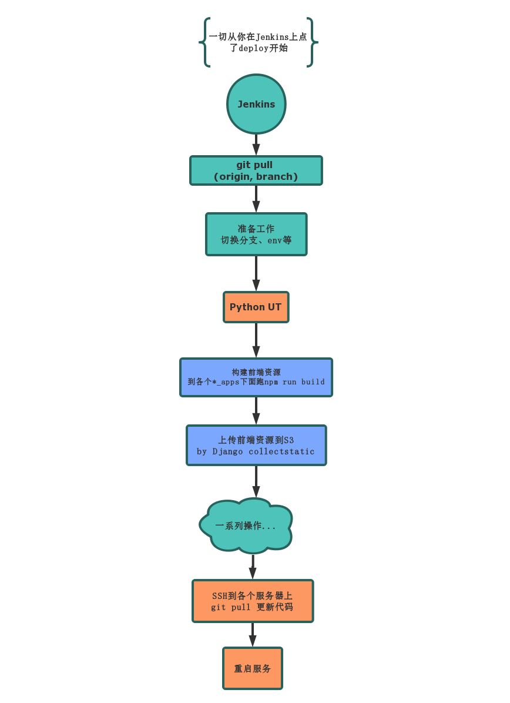

# 老破前端构建系统的
## 更新换代

===

# Why


===

## 古典发版系统



===

## 再说一下collectstatic


* settings.py
``` py
STATICFILES_DIRS = (
    HUIPAY_STATICFILES_FOLDER,
    PRODUCTION_STATICFILES_FOLDER
)
```
* settings.test.py
``` py
HUIPAY_STATICFILES_FOLDER='ygg/production_apps/dist/static'
PRODUCTION_STATICFILES_FOLDER='ygg/huipay_apps/dist/static'
```
* post process: index.js => index.8dc72b3f1f60.js
* staticfiles.json